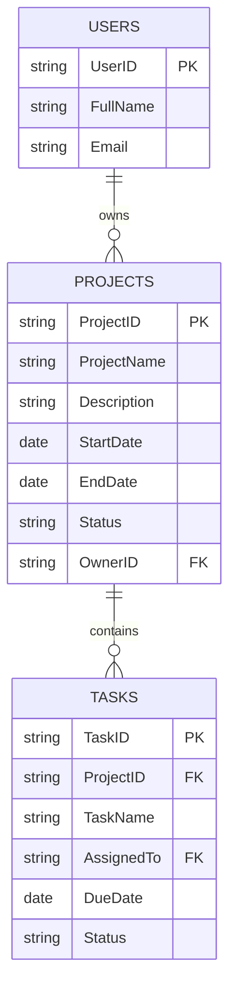

# Entity Relationship Diagram

```mermaid
erDiagram
    USERS ||--o{ PROJECTS : owns
    PROJECTS ||--o{ TASKS : contains

    USERS {
        string UserID PK
        string FullName
        string Email
    }

    PROJECTS {
        string ProjectID PK
        string ProjectName
        string Description
        date StartDate
        date EndDate
        string Status
        string OwnerID FK
    }

    TASKS {
        string TaskID PK
        string ProjectID FK
        string TaskName
        string AssignedTo FK
        date DueDate
        string Status
    }
```
